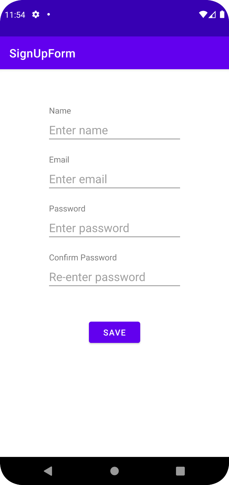
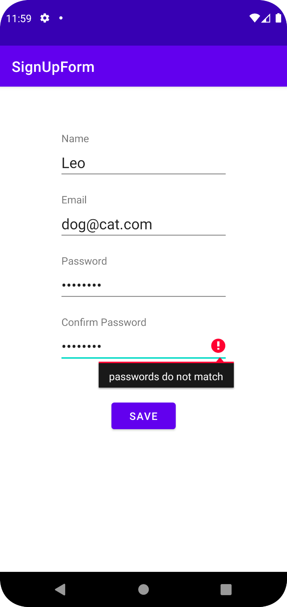
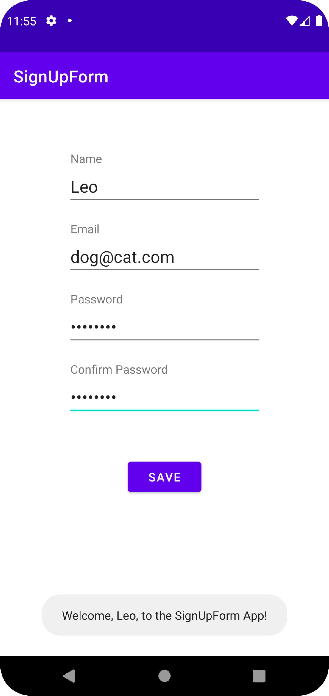

# TU CIS-3515 Assignment 2

The SignUpForm Android application collects a user's name, email, and password through a form.
When the form is submitted using the 'SAVE' button, it verifies that the name and email field are not blank and that the passwords are matching not empty and matching.
In the case of an empty/blank field or mismatching passowrds, a relevent error will be displayed to the user.
On successful submission, a toast will be displayed to the user welcoming them to the app!

  
  
  

